* Table of Contents
{:toc style="float: right;"}

[GitHub Project](https://github.com/mathybit/ml-tutorials){:target="_blank"}

## Introduction

We saw in *[Intro to Autoencoders](/auto-intro/)* how the encoding space was a non-convex manifold, which makes basic autoencoders a poor choice for generative models. *Variational autoencoders* fix this issue by ensuring the coding space follows a desirable distribution that we can easily sample from - typically the standard normal distribution.

The theory behind variational autoencoders can be quite involved. Instead of going into too much detail, we try to gain some intuition behind the basic architecture, as well as the choice of loss function and how it helps the autoencoder learn the desired coding distribution.

## Basic Architecture

| 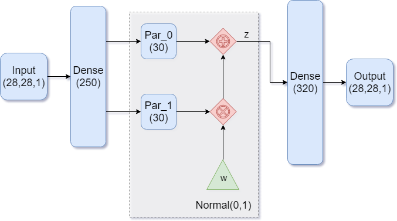 |
|:--:|
| *Figure 1: A dense autoencoder* |
{:class="table-left" width="50%"}

Our goal in building the model is to end up with normally distributed encodings. While that sounds complicated, having a model that generates such encodings is as simple as *having the model learn the parameters of the normal distribution*. There are two: the mean and the standard deviation.

*Figure 1* shows such an architecture. Notice how the encoder part of the model is feeding into TWO dense layers. These are the two parameters for our distribution, with `Par_0` representing the mean $$\mu$$, and `Par_1` representing the standard deviation $$\sigma$$. We then feed in a standard normal variable $$w$$ and transform it into an encoding vector $$z$$ the usual way:
\$$
z = \mu + \sigma \cdot w 
\$$

where each of these variables is a 30-dimensional vector.

## Implementation

We use Keras to implement our model and train it on MNIST. See the [introductory article on autoencoders](/auto-intro/#prepping-the-data) for details on how to import and prepare the data. For the rest of the model, we will need the following imports:


from keras import backend as K
from keras.models import Model
from keras.engine.input_layer import Input
from keras.layers.core import Activation, Dense, Flatten, Reshape, Lambda
from keras.optimizers import Adam


### Encoder model

A variational autoencoder is very similar to a [regular autoencoder](/auto-intro/), except it has a more complicated encoder. We begin by specifying our model hyperparameters, and define a function which samples a standard normal variable $$w$$ and transforms it into our codings $$z$$ via $$\mu + \sigma \cdot w$$.


K.clear_session()
n_codings = 30
n_inputs = height * width * channels

def sampling(args):
    param0, param1 = args
    batch_size = K.shape(param0)[0]
    dim = K.int_shape(param0)[1]
    normal_01 = K.random_normal(shape=(batch_size, dim))
    return param0 + param1 * normal_01


Since we have two separate dense layers (the distribution parameters) that take the same input, we build and connect the layers by hand. The code for building the layers is show below. Notice how both `param0` and `param1` take `hidden1` as input, consistent with *Figure 1*. 


inputs = Input(shape=(height, width, channels,), name='inputs')
inputs_flat = Flatten()(inputs)
hidden1 = Dense(units=250, activation='relu')(inputs_flat)

param0 = Dense(n_codings, name='param0')(hidden1)
param1 = Dense(n_codings, name='param1')(hidden1)

# We feed the param0 and param1 into the Lambda layer, whose function is to 
# tranform a standard normal variable
codings = Lambda(sampling, output_shape=(n_codings,), name='codings')([param0, param1])


The Lambda layer is where the magic happens. It takes the layers `param0` and `param1` as input (our distribution parameters), and performs the computation outlined by the `sampling()` function. The layer outputs our desired encoding.

Finally, we use the `Model` class to instantiate our encoder:

encoder = Model(inputs, [codings, param0, param1], name='encoder')
encoder.summary()


Notice when we instantiate the model, we ask it to output 3 things: the codings, followed by the two parameters. This simply allows us to inspect the learned parameters later. We could have easily used the following:


encoder = Model(inputs, codings, name='encoder')


### Decoder and VAE models

The decoder model is the same as before. Here's how the implementation looks if we build it layer by layer and use the `Model` class instead of `Sequential` to instantiate it:


n_outputs = n_inputs

latent_inputs = Input(shape=(n_codings,), name='latent_inputs')
hidden2 = Dense(320, activation='relu')(latent_inputs)
output_flat = Dense(units=n_outputs, activation='sigmoid')(hidden2)

output = Reshape(target_shape=(height,width,channels,), name='output')(output_flat)

decoder = Model(latent_inputs, output, name='decoder')
decoder.summary()


Lastly, we stack the two together so we can train the autoencoder:

outputs = decoder(  encoder(inputs)[0]  )
vae = Model(inputs, outputs, name='vae')
vae.summary()


### Optimizer and loss function

Constructing loss function is a bit trickier than before. Training should achieve two goals:
* good image reconstructions
* a coding space that is normally distributed

For the reconstruction part, we penalize the model using MSE. However, since we didn't flatten our inputs before feeing them into the model, they have shape (?, 28, 28, 1), and we cannot simply use `keras.losses.mse` since this takes the average along the last axis, i.e. the channels `axis=-1` (see the [source code](https://github.com/keras-team/keras/blob/master/keras/losses.py){:target="_blank"} of the Keras implementation). Instead, we code the MSE error by hand using the Keras backend.


reconstruction_loss = K.sum(K.square(outputs - inputs), axis=[1, 2, 3])
#reconstruction_loss /= n_inputs


Notice how we didn't actually divide by the number of inputs. It's certainly okay to do so (we are computing an average, after all), but that results in smaller gradients. Instead, we can think of this as a pixel-wise MSE, i.e.
\$$
(\text{original pixel} - \text{reconstruction pixel})^2
\$$
and adding each of those losses together over all $$784$$ pixels (across the single black and white channel) by specifying the `axis=[1, 2, 3]` parameter.

We also need to penalize the model if it tries to create encodings that are not normally distributed. A thorough explanation of the following piece of code is in the *Mathy Bit* section.


eps = 1e-10
dist_loss = K.square(param0) + K.square(param1) - 1 - K.log( eps + K.square(param1) )
dist_loss = 0.5 * K.sum(dist_loss, axis=-1)


Our total loss will be the average of the two losses we constructed above. Taking the mean collapses the 1-dimensional vector (whose size is the training batch size) to a scalar.


loss = K.mean(reconstruction_loss + dist_loss)


Finally, we pick an optimizer, compile our models, and train it. The choice for loss for the encoder and decoder models is irrelevant, but we need to compile them if we want to use them individually in the future.


optimizer = Adam()

encoder.compile(loss='binary_crossentropy', optimizer="adam")
decoder.compile(loss='binary_crossentropy', optimizer="adam")
vae.add_loss(loss)
vae.compile(optimizer=optimizer)
vae.summary()

n_epochs = 50
batch_size = 250
n_batches = X_train.shape[0] // batch_size

print("Training for", n_epochs, "epochs with", n_batches, "batches of size", batch_size)
history = vae.fit(
    X_train, batch_size=batch_size, epochs=n_epochs, verbose=1
)
print("Training finished.")


## The Mathy Bit: Kullback–Leibler Divergence

Let's try to understand the distribution loss of our variational model, and where it comes from. Recall that our 30-dimensional coding vector $$z$$ is obtained in the `sampling()` function by first sampling $$w$$ from a standard normal distribution, and transforming it via $$z = \mu + \sigma \cdot w$$:

def sampling(args):
    param0, param1 = args # <-- unpack the mean and sdev layers, respectively
    batch_size = K.shape(param0)[0]
    dim = K.int_shape(param0)[1]
    normal_01 = K.random_normal(shape=(batch_size, dim)) # <-- this is w
    return param0 + param1 * normal_01 # <-- transform w into codings z and return it


| 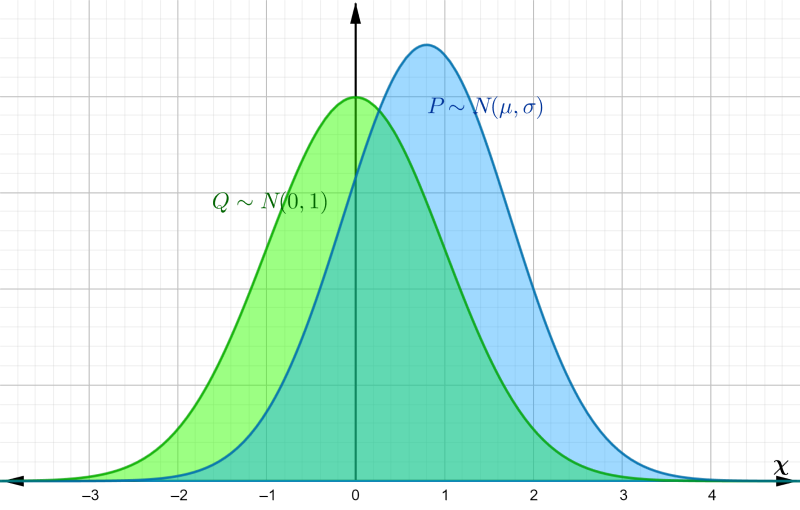 |
|:--:|
| *Figure 2: distinct Gaussian distributions* |
{:class="table-left" width="45%"}

These operations are done component-wise, meaning that each component $$z_i$$ of the 30-dim vector $$z$$ is a normal random variable with mean $$\mu_i$$ and variance $$\sigma_i^2$$ . *The components are mutually independent*, so we can simplify our analysis and work with univariate $$z$$ and $$w$$.

We want to be able to approximate the coding $$z$$ by a standard normal distribution, so we need a way to measure how far off $$z$$ is from a standard normal. For this we use the *[Kullback–Leibler divergence](https://en.wikipedia.org/wiki/Kullback%E2%80%93Leibler_divergence){:target="_blank"}*, which is a way to measure the difference between two probability distributions $$P$$ and $$Q$$. For continuous distributions, KL divergence is defined as
\$$
\begin{equation}
D_{KL}(P \|\| Q) = \int_\chi p(x) \ln \dfrac{p(x)}{q(x)} dx
\end{equation}
\$$
where $$p(x)$$ and $$q(x)$$ are the probability density functions of $$P$$ and $$Q$$, respectively, and the integral is taken over the entire sample space $$\chi$$.

### Surprise and Entropy

To understand where the formula for KL-divergence comes from, and why it can be used as a measure of the difference between probability distributions, we take a quick detour into information theory.

The "closeness" of distributions can be reduced to the outcomes and their corresponding probabilities. For continuous distributions (like the normal), there are infinitely many outcomes (in our case, all of $$\mathbb{R}$$), and technically each value occurs with probability zero. This explains why we need to accumulate a differential by integrating over the sample space, but what does the integrand in **(1)** represent?

Observing a random event evokes some amount of surprise. This can be quantified by a *surprise function $$I$$*. It is reasonable to assume that $$I$$ depends only on the probability of that event, so $$I:[0, 1] \to \mathbb{R}^+$$. We define the *surprise* (or *information*) associated with an event occurring with probability $$p$$ byr
\$$
\begin{equation}
I(p) = -\ln(p)
\end{equation}
\$$
This definition makes sense as a measure of surprise, since as $$p \to 0$$, we have $$I(p) \to \infty$$ monotonically (rare events are more surprising than common events), and also $$I(1) = 0$$ (there is no surprise when seeing events that are certain).

Suppose $$X$$ is a discrete random variable whose probability distribution is $$P$$. The *entropy $$H(X)$$ of $$X$$* is given by
\$$
\begin{equation}
H(X) = -\sum_x p(x) \ln p(x) = \sum_x p(x) I(p(x)) = \mathrm{E}_P(I(P))
\end{equation}
\$$

where $$p(x) = \mathrm{Pr}(X = x)$$ and $$x$$ ranges over all possible values of $$X$$. In other words, *entropy is the expected amount of surprise evoked by a realization of $$X$$*. This definition can be expanded to continuous random variables:
\$$
\begin{equation}
H(X) = -\int_\chi p(x) \ln p(x) dx
\end{equation}
\$$

Since we can think of entropy as measuring the degree of randomness of $$X$$, we can use it to quantify the similarity of two distributions $$P$$ and $$Q$$. One might think to simply take the difference $$H(Q) - H(P)$$, but that is not enough (one can imagine two distinct pdfs with the same entropy). The expectation of information *must be done with respect to one of the distributions*, and so the *KL divergence from $$Q$$ to $$P$$* is
\$$
D_{KL}(P \|\| Q) = \int_\chi p(x) \ln \dfrac{p(x)}{q(x)} dx
\$$

which is done with respect to $$P$$. Using properties of logarithms, this can be rewritten as 
\$$\begin{eqnarray}
D_{KL}(P \|\| Q) &=& -\int_\chi p(x) \ln q(x) dx + \int_\chi p(x) \ln p(x) dx \nonumber \\\
&=& \mathrm{E}_P(I(Q)) - \mathrm{E}_P(I(P)) \nonumber
\end{eqnarray}\$$

The first term is the average information of $$Q$$ with respect to $$P$$, also called the *cross-entropy of $$P$$ and $$Q$$*, and is sometimes denoted by $$H(P, Q)$$. The second term is the entropy of $$P$$, $$H(P)$$. Hence this can be thought of as the average information gain (or loss) when $$Q$$ is used instead of $$P$$.

| 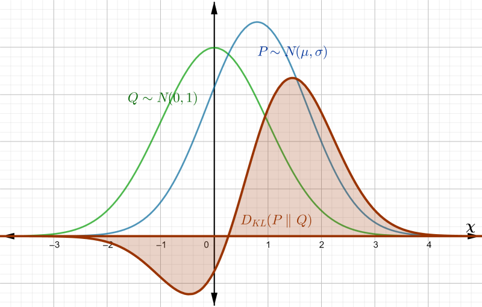 |
|:--:|
| *Figure 3: area to be integrated by $$D_{KL}(P \|\| Q)$$* |
{:class="table-left" width="45%"}

### KL-div for Gaussians

In the context of our autoencoder, $$P$$ is the true distribution of our codings, while $$Q$$ is an approximation. In order to use $$Q$$ (standard normal) to generate digits, we want to bring $$P$$ closer to $$Q$$, so we minimize $$D_{KL}(P \| Q)$$ by incorporating it into our model's total loss function.

Because of the autoencoder's architecture (in particular the `sampling()` function), we know $$P$$ is normal with mean $$\mu$$ and variance $$\sigma$$, while $$Q$$ is standard normal. Let's go ahead and compute $$D_{KL}(P \| Q)$$ between these normal distributions.

The density functions of $$P$$ and $$Q$$ are given by
\$$
p(x) = \dfrac{1}{\sqrt{2\pi \sigma^2}} \exp\left(-\frac{(x - \mu)^2}{2\sigma^2}\right) \quad\text{and}\quad
q(x) = \dfrac{1}{\sqrt{2\pi}} \exp\left(-\frac{x^2}{2}\right)
\$$

Plugging these into **(1)** and applying the rules of logarithms gives
\$$\begin{eqnarray}
D_{KL}(P \|\| Q) &=& \int_\chi \left(\ln p(x) - \ln q(x)\right) p(x) dx \nonumber \\\
&=& \int_\chi  \left[ \ln\frac{1}{\sigma} + \frac{1}{2}\left( x^2 - \left(\frac{x - \mu}{\sigma}\right)^2\right)\right] p(x) dx \nonumber
\end{eqnarray}\$$

which is just an expectation relative to $$P$$. Using properties of expectation, this becomes
\$$\begin{eqnarray}
D_{KL}(P \|\| Q) &=& \mathrm{E}_P \left[\ln \frac{1}{\sigma} + \frac{1}{2} \left( X^2 - \left(\frac{X - \mu}{\sigma}\right)^2\right)\right] \nonumber \\\
&=& \ln\frac{1}{\sigma} + \frac{1}{2} \mathrm{E}_P(X^2) - \frac{1}{2} \mathrm{E}_P\left[\left(\frac{X - \mu}{\sigma}\right)^2\right] \nonumber
\end{eqnarray}\$$

The expectations are done with respect to $$P$$, which means $$X \sim N(\mu, \sigma)$$. Recall that the variance of a random variable $$Y$$ can be defined as $$\mathrm{Var}(Y) = \mathrm{E}\left[(Y - \mu_Y)^2\right]$$, so last expectation becomes
\$$
\mathrm{E}_P\left[\left(\frac{X - \mu}{\sigma}\right)^2\right] =
\frac{1}{\sigma^2} \mathrm{E}_P\left[(X - \mu)^2\right] =
\frac{1}{\sigma^2} \mathrm{Var}(X) = 1
\$$

Also, $$\mathrm{E}_P(X^2)$$ can be rewritten as
\$$
\mathrm{E}_P(X^2 - 2X\mu + \mu^2 + 2X\mu - \mu^2) = 
\mathrm{E}_P\left[(X - \mu)^2\right] + 2\mu\mathrm{E}_P(X) - \mathrm{E}_P(\mu^2) =
\sigma^2 + \mu^2
\$$

and so the KL divergence from $$Q$$ to $$P$$ becomes
\$$
\begin{equation}
D_{KL}(P \|\| Q) = 
\ln\frac{1}{\sigma} + \frac{\sigma^2 + \mu^2}{2} - \frac{1}{2} = 
\boxed{\frac{1}{2}\left(\mu^2 + \sigma^2 - 1 - \ln(\sigma^2)\right)}
\end{equation}
\$$

Keeping in mind that $$\mu$$ is `param0` and $$\sigma$$ is `param1`, our implementation of the KL loss is consistent with **(5)**:

eps = 1e-10
dist_loss = K.square(param0) + K.square(param1) - 1 - K.log( eps + K.square(param1) )
dist_loss = 0.5 * K.sum(dist_loss, axis=-1)


where `eps` ensures we don't take log of zero.

## Reconstructive and Generative Results

|  |
|:--:|
| *Figure 4: Generative progress over 6 epochs* |
{:class="table-left" width="30%"}

Training converges rapidly, and within a few epochs we are able to use the model for generating images of handwritten digits. *Figure 4* shows the model's generative ability improving over the first 6 epochs of training.

As training also puts emphasis on normally distributed encodings, the model lost some of its reconstructive ability over a regular autoencoder:

|  |
|:--:|
| *Figure 5: Reconstruction output of our model* |
{:class="table-center" width="55%"}

## Coding Space

We can check to see that our model indeed produces codings that are normally distributed with mean 0 and variance 1. *Figure 6* shows histograms for various coordinates of the encoded training set:

| 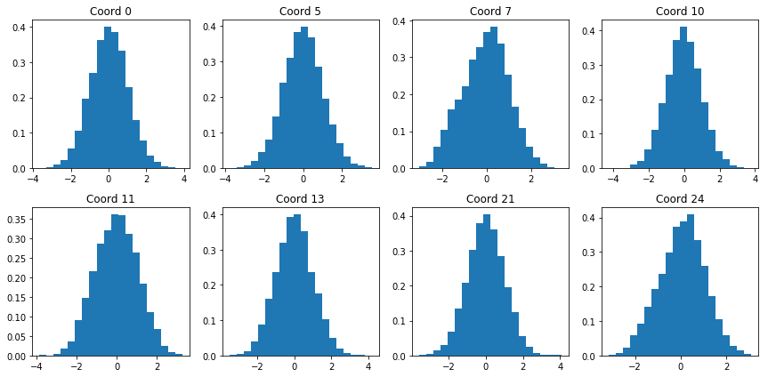 |
|:--:|
| *Figure 6: Encoding coordinate distributions* |
{:class="table-center" width="80%"}

The distributions visually resemble the standard normal: they are centered around zero, appear symmetrical, and most of the values lie between -2 and 2. While not perfect (coordinate 7 is a bit skewed), the generative results are much better over a standard autoencoder:

| 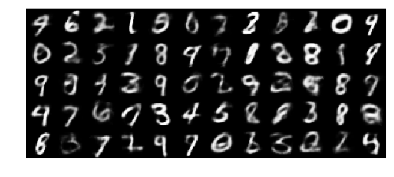 |
|:--:|
| *Figure 7: More generated digits from our model* |
{:class="table-center" width="50%"}

## PCA

We can also visualize the coding distributions by perform 2-dimensional PCA. Notice how the variational model gives a convex coding space.

| 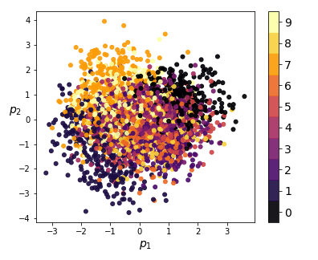{:width="50%" class="image-right"} 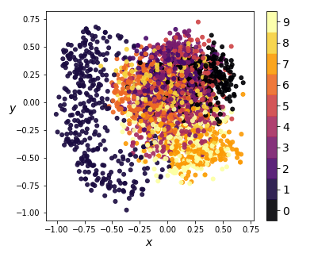{:width="50%"} |
|:--:|
| *Figure 8: 2-dim PCA on encodings from our variational autoencoder (left) and a standard autoencoder (right)* |
{:class="table-center"}

If we ignore the color categories, the PCA output on our variational model resembles a 2-dimensional elliptical Gaussian cloud. One would also expect PCA in 3 dimensions to give a convex cloud, and it does:

| 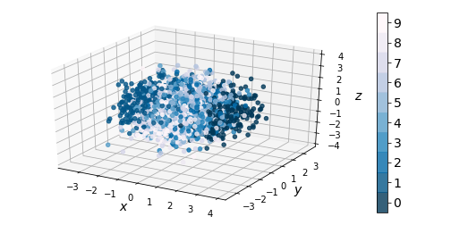{:width="50%" class="image-right"} 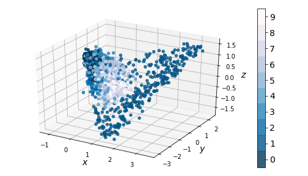{:width="50%"} |
|:--:|
| *Figure 9: 3-dim PCA on encodings from our variational autoencoder (left) and a standard autoencoder (right)* |
{:class="table-center"}

## Interpolations

Having a convex coding space is not only advantageous for generating images that better resemble those in the original data set. It is also useful in allowing smooth interpolations between digits.

| {:class="image-right" width="45%"}  {:class="image-left" width="45%"} |
|:--:|
| *Figure 10: Digit interpolations from our variational autoencoder (left) and a standard autoencoder (right)* |
{:class="table-center" width="65%"}

## Logvar training

One common tweak to the variational autoencoder is to have the model learn `param1` as $$\gamma = \ln(\sigma^2)$$ instead of $$\sigma$$, resulting in faster convergence of the model during training. If we need to compute $$\sigma$$, we simply do $$\sigma = e^{\gamma/2}$$.

To implement this, we first modify the `sampling()` function to ensure our standard normal variable gets the correct scaling:

def sampling(args):
    param0, param1 = args # <-- unpack the mean and sdev layers, respectively
    batch_size = K.shape(param0)[0]
    dim = K.int_shape(param0)[1]
    normal_01 = K.random_normal(shape=(batch_size, dim)) # <-- this is w
    return param0 + K.exp(0.5 * param1) * normal_01 # <-- recover sigma, then transform w into z as before


Taking `K.exp(0.5 * param1)` gives $$e^{\gamma/2} = \sigma$$, as needed. We also need to modify the calculation for `dist_loss`:

dist_loss = K.square(param0) + K.exp(param1) - 1 - param1
dist_loss = 0.5 * K.sum(dist_loss, axis=-1)


giving us $$D_{KL} = 0.5\left(\mu^2 + e^{\gamma} - 1 - \gamma\right) = 0.5\left(\mu^2 + \sigma^2 - 1 - \ln(\sigma^2)\right)$$, as desired.

## Conditional VAE

Another modification to the VAE is to add a *conditioning vector* to our inputs. This requires the data to be labeled (the conditioning vector will depend on the label).

| 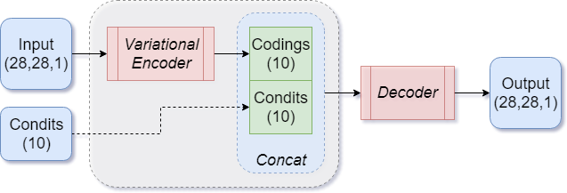 |
|:--:|
| *Figure 11: Basic CVAE architecture* |
{:class="table-left" width="50%"}

The MNIST dataset is simple enough that we can bypass the encoder part of the model, and feed the conditioning vector directly into the decoder by *concatenating* it with the codings output of the encoder, as shown in *Figure 11*.

### Implementation

First we prepare the conditioning vector, which will be a *one-hot vector* representation of the MNIST labels. Keras provides the `to_categorical()` function, which does this for us automatically:


from keras.datasets import mnist

X_train_cond = to_categorical(y_train)
X_test_cond = to_categorical(y_test)


Let's build the encoder model. We use a CNN architecture, which means we can't concatenate the `condits` vector directly to the input images. We bypass it all the way to the end, so the encoder never really sees the conditioning. However, if we wanted to incorporate it, we'd 


n_codings = 10
n_attributes = 10 #dimension of the conditioning vector

K.clear_session()

def sampling(args):
    param_0, param_1 = args
    batch_size = K.shape(param_0)[0]
    dim = K.int_shape(param_0)[1]
    normal_01 = K.random_normal(shape=(batch_size, dim))
    return param_0 + K.exp(0.5 * param_1) * normal_01
	
inputs = Input(shape=(height, width, channels,), name='inputs')
condits = Input(shape=(n_attributes,), name='condits')

conv1 = Conv2D(filters=16, kernel_size=5, strides=1, padding='same', activation='relu')(inputs)
pool1 = MaxPooling2D(pool_size=(2, 2))(conv1)

conv2 = Conv2D(filters=32, kernel_size=5, strides=1, padding='same', activation='relu')(pool1)
pool = MaxPooling2D(pool_size=(2, 2))(conv2)

flatten = Flatten()(pool) # <-- we may also concatenate 'condits' here

dense = Dense(units=250, activation='relu')(flatten)

param_0 = Dense(n_codings, name='param_0')(dense)
param_1 = Dense(n_codings, name='param_1')(dense)
codings1 = Lambda(sampling, output_shape=(n_codings,), name='codings1')([param_0, param_1])

# Bypass the encoder model, and concatenate 'condits' to form the output
codings = concatenate([codings1, condits], axis=-1, name='codings')

encoder = Model([inputs, condits], [codings, param_0, param_1], name='encoder')


Notice how even though the encoder technically compresses the inputs to a 10-dim representation, the actual `codings` vector is 20-dimensional, since we are concatenating two 10-dim vectors together (encoded representation and one-hot conditioning). We take this into account for the decoder's input:


conv_layer_index = -8

latent_inputs = Input(shape=(n_codings + n_attributes,), name='latent_inputs')

gdense = Dense(120, activation='relu')(latent_inputs)

h0 = encoder.layers[conv_layer_index].output_shape[1]
w0 = encoder.layers[conv_layer_index].output_shape[2]
feats = 32
denseflat = Dense(units=h0*w0*feats, activation='relu')(gdense)

reshape = Reshape(target_shape=(h0, w0, feats,))(denseflat)

up1 = UpSampling2D(size=(2,2))(reshape)
up1_1 = Conv2D(filters=16, kernel_size=5, strides=1, padding='same')(up1)
up1a = Activation('relu')(up1_1)

up2 = UpSampling2D(size=(2,2))(up1a)
up2_1 = Conv2D(filters=8, kernel_size=5, strides=1, padding='same')(up2)
up2a = Activation('relu')(up2_1)

output = Conv2D(filters=1, kernel_size=5, strides=1, padding='same', activation='sigmoid', name='output')(up2a)

decoder = Model([latent_inputs], output, name='decoder')


We also need to modify the code which stacks the two models together for training, to account for the extra conditioning input:


outputs = decoder(  encoder([inputs, condits])[0]  )
cvae = Model([inputs, condits], outputs, name='cvae')
cvae.summary()


The loss/optimizer parts remain unchanged (we use logvar version). However, the training code needs the additional input:


history = cvae.fit(
    [X_train, X_train_cond], batch_size=batch_size, epochs=n_epochs, verbose=1
)


| 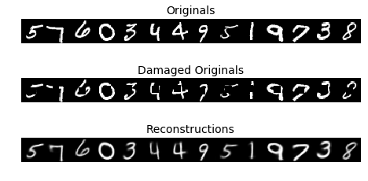 |
|:--:|
| *Figure 12: CVAE reconstructions* |
{:class="table-left" width="50%"}

### Results

Having the extra conditioning information allows the CVAE to play a *corrective role* in reconstructions. *Figure 12* shows original MNIST images with a square area cut out, and the CVAE's best guess at reconstructing that original.

More interestingly, when used as a generative model, the CVAE gives us more control over the type of digit we want to generate.  

| 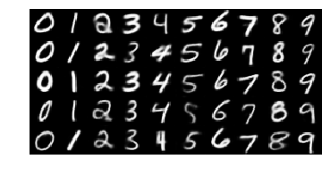{:class="image-right" width="45%"}  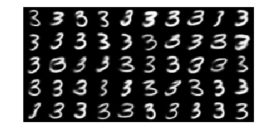{:class="image-left" width="45%"} |
|:--:|
| *Figure 13: Controlled output of the CVAE* |
{:class="table-center"}

We see that the one-hot conditioning vector controls the type of digit generated, while the 'encoding' piece *controls the writing style*. This means the encoder model doesn't have to learn what digit is represented, only the writing style. This is reflected in the distribution of the coding space:

| 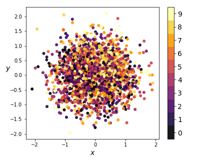{:width="44%" class="image-right"} 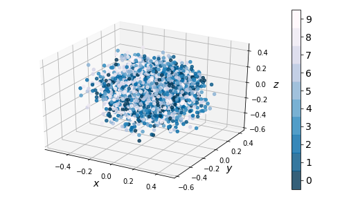{:width="56%"} |
|:--:|
| *Figure 14: Kernel PCA on encodings from CVAE in 2D (left) and 3D (right)* |
{:class="table-center"}

Notice there is *no clustering* taking place - the coding space is homogenous. This enables us to perform smooth digit interpolations between styles (keeping the digit type constant), between digits (keeping the style constant), or both. We *[built a visualization](/vis-cvae/)* that allows the reader to explore the coding space.

This wraps up our analysis of the variational autoencoder, and why it works as a generative model. In a future post, we will introduce generative adversarial models, see how they compare to variational autoencoders, and use both to produce realistic images of people.